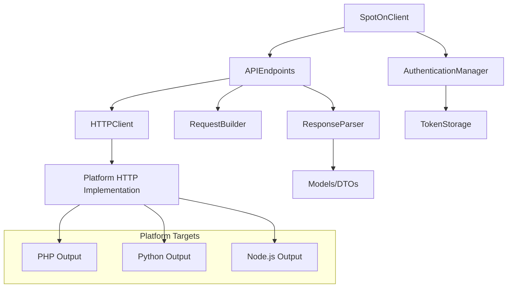

# Design Document

## Overview

The SpotOn Haxe SDK will be architected as a cross-platform library that provides a unified interface to SpotOn's Central API. The design leverages Haxe's compile-time features and cross-platform capabilities to generate native-feeling SDKs for PHP, Python, and Node.js from a single codebase.

The SDK will follow a layered architecture with clear separation of concerns:
- **API Layer**: High-level methods that correspond to SpotOn API endpoints
- **HTTP Client Layer**: Platform-agnostic HTTP communication
- **Authentication Layer**: Token management and credential handling
- **Model Layer**: Strongly-typed data structures for requests and responses
- **Error Handling Layer**: Consistent error representation across platforms

## Architecture

### Core Components



### Package Structure

```
src/
├── spoton/
│   ├── SpotOnClient.hx           # Main SDK entry point
│   ├── auth/
│   │   ├── AuthenticationManager.hx
│   │   ├── TokenStorage.hx
│   │   └── Credentials.hx
│   ├── http/
│   │   ├── HTTPClient.hx
│   │   ├── RequestBuilder.hx
│   │   └── ResponseParser.hx
│   ├── endpoints/
│   │   ├── BaseEndpoint.hx
│   │   ├── BusinessEndpoint.hx      # Location info and liveness
│   │   ├── OrderEndpoint.hx         # Order submission, proposal, cancellation
│   │   ├── MenuEndpoint.hx          # Menus, items, modifiers, categories
│   │   ├── LoyaltyEndpoint.hx       # Customer management, points, rewards
│   │   ├── ReportingEndpoint.hx     # Historical order data
│   │   ├── LaborEndpoint.hx         # Employees, jobs, time punches (EXPRESS ONLY)
│   │   ├── OnboardingEndpoint.hx    # OAuth2 location authorization
│   │   └── WebhookEndpoint.hx       # Webhook event handling utilities
│   ├── models/
│   │   ├── common/
│   │   │   ├── Address.hx
│   │   │   ├── Geolocation.hx
│   │   │   ├── Pagination.hx
│   │   │   └── ErrorResponse.hx
│   │   ├── business/
│   │   │   └── Location.hx
│   │   ├── orders/
│   │   │   ├── Order.hx
│   │   │   ├── OrderItem.hx
│   │   │   ├── OrderPayment.hx
│   │   │   ├── OrderCustomer.hx
│   │   │   ├── OrderFulfillment.hx
│   │   │   └── OrderTotals.hx
│   │   ├── menus/
│   │   │   ├── Menu.hx
│   │   │   ├── MenuItem.hx
│   │   │   ├── Category.hx
│   │   │   ├── Modifier.hx
│   │   │   ├── ModifierGroup.hx
│   │   │   └── Price.hx
│   │   ├── loyalty/
│   │   │   ├── Customer.hx
│   │   │   ├── Promotion.hx
│   │   │   ├── Discount.hx
│   │   │   └── LoyaltyTransaction.hx
│   │   ├── reporting/
│   │   │   ├── ReportOrder.hx
│   │   │   ├── LineItem.hx
│   │   │   ├── Payment.hx
│   │   │   └── Tax.hx
│   │   ├── labor/
│   │   │   ├── Employee.hx
│   │   │   ├── Job.hx
│   │   │   ├── TimePunch.hx
│   │   │   └── Break.hx
│   │   ├── onboarding/
│   │   │   ├── LocationCandidate.hx
│   │   │   └── OnboardingStatus.hx
│   │   └── webhooks/
│   │       ├── WebhookEvent.hx
│   │       └── EventDetails.hx
│   ├── errors/
│   │   ├── SpotOnException.hx
│   │   ├── AuthenticationException.hx
│   │   ├── NetworkException.hx
│   │   └── APIException.hx
│   └── utils/
│       ├── DateUtils.hx
│       ├── ValidationUtils.hx
│       └── WebhookSignatureValidator.hx
```

## Components and Interfaces

### SpotOnClient (Main Entry Point)

The primary interface that developers will interact with across all platforms.

```haxe
class SpotOnClient {
    private var auth: AuthenticationManager;
    private var httpClient: HTTPClient;
    
    // Endpoint accessors
    public var business: BusinessEndpoint;
    public var orders: OrderEndpoint;
    public var menus: MenuEndpoint;
    public var loyalty: LoyaltyEndpoint;
    public var reporting: ReportingEndpoint;
    public var labor: LaborEndpoint;
    public var onboarding: OnboardingEndpoint;
    public var webhooks: WebhookEndpoint;
    
    public function new(credentials: Credentials, ?config: ClientConfig);
    public function authenticate(): Promise<Bool>;
    public function setDebugMode(enabled: Bool): Void;
}
```

### Authentication Manager

Handles OAuth 2.0 or API key authentication with automatic token refresh.

```haxe
class AuthenticationManager {
    private var credentials: Credentials;
    private var tokenStorage: TokenStorage;
    
    public function authenticate(): Promise<AuthToken>;
    public function refreshToken(): Promise<AuthToken>;
    public function isAuthenticated(): Bool;
    public function getAuthHeaders(): Map<String, String>;
}
```

### HTTP Client

Platform-agnostic HTTP client that compiles to appropriate implementations.

```haxe
class HTTPClient {
    private var baseUrl: String;
    private var defaultHeaders: Map<String, String>;
    
    public function get(path: String, ?params: Dynamic): Promise<Response>;
    public function post(path: String, ?data: Dynamic): Promise<Response>;
    public function put(path: String, ?data: Dynamic): Promise<Response>;
    public function delete(path: String): Promise<Response>;
}
```

### Base Endpoint

Abstract base class for all API endpoint implementations.

```haxe
abstract class BaseEndpoint {
    protected var client: HTTPClient;
    protected var auth: AuthenticationManager;
    
    protected function makeRequest(method: String, path: String, ?data: Dynamic): Promise<Response>;
    protected function validateParams(params: Dynamic): Void;
}
```

### Response Models

Strongly-typed models for API responses using Haxe's type system, based on actual SpotOn API schemas.

```haxe
// Business Models
typedef Location = {
    var id: String;                    // Pattern: ^BL-[A-Z0-9]{4}-[A-Z0-9]{4}-[A-Z0-9]{4}$
    var name: String;
    var email: String;
    var phone: String;
    var address: Address;
    var geolocation: Geolocation;
    var timezone: String;              // IANA timezone (e.g., 'America/New_York')
}

typedef Address = {
    var address_line_1: String;
    var address_line_2: String;
    var city: String;
    var state: String;
    var zip: String;
    var country: String;
}

typedef Geolocation = {
    var latitude: Float;
    var longitude: Float;
}

// Order Models
typedef Order = {
    var id: String;                    // SpotOn order ID (read-only)
    var external_reference_id: String; // External system ID
    var location_id: String;
    var line_items: Array<OrderItem>;
    var state: OrderState;
    var source: OrderSource;
    var customer: OrderCustomer;
    var fulfillment: OrderFulfillment;
    var payments: Array<OrderPayment>;
    var totals: OrderTotals;
    var menu_id: String;
    var signature: OrderSignature;
    var discounts: Array<Discount>;
    var fees: Array<Fee>;
    var placed_at: Date;
    var ready_at: Date;
    var display_id: String;            // Max 12 printable characters
}

enum OrderState {
    ORDER_STATE_OPEN;
    ORDER_STATE_DRAFT;
    ORDER_STATE_CANCELED;
    ORDER_STATE_CLOSED;
}

enum FulfillmentType {
    FULFILLMENT_TYPE_DINE_IN;
    FULFILLMENT_TYPE_PICKUP;
    FULFILLMENT_TYPE_DELIVERY;
}

// Menu Models
typedef Menu = {
    var id: String;
    var location_id: String;
    var name: String;
    var active: Bool;
    var schedule: Schedule;
    var schedule_overrides: Array<ScheduleOverride>;
    var categories: Array<Category>;
    var created_at: Date;
}

typedef MenuItem = {
    var id: String;
    var location_id: String;
    var menu_id: String;
    var name: String;
    var description: String;
    var active: Bool;
    var is_available: Bool;
    var image_url: String;
    var is_alcohol: Bool;
    var category_references: Array<CategoryReference>;
    var taxes: Array<Tax>;
    var modifier_groups: Array<ModifierGroup>;
    var item_groups: Array<ItemGroup>;
    var created_at: Date;
}

// Loyalty Models
typedef Customer = {
    var id: String;
    var email: String;
    var phone: String;                 // Format: +12345678901
    var full_name: String;
    var birthdate: Date;
    var points_available: Int;         // Fixed-point (4 decimal places)
    var promotions: Array<Promotion>;
    var total_checkins: Int;
    var total_spend: Int;              // In cents
}

typedef Promotion = {
    var id: String;
    var type: PromotionType;
    var deal_type: PromotionSubtypeDeal;
    var name: String;
    var points_required: Int;          // Fixed-point (4 decimal places)
    var discount: Discount;
    var valid: ValidDuration;
}

enum PromotionType {
    TYPE_REWARD;                       // Points-based
    TYPE_DEAL;                         // Dollar/percentage-based
}

// Labor Models (EXPRESS ONLY)
typedef Employee = {
    var id: String;                    // UUID
    var first_name: String;
    var last_name: String;
    var email: String;
    var jobs: Array<AssignedJob>;
    var status: EmployeeStatus;
    var permission: EmployeePermission;
    var created_at: Date;
    var updated_at: Date;
}

typedef TimePunch = {
    var id: String;
    var job_id: String;
    var wage: Int;                     // In cents
    var clock_in: Date;
    var clock_out: Date;               // 0001-01-01T00:00:00Z means ongoing
    var breaks: Array<Break>;
    var created_at: Date;
    var updated_at: Date;
}

// Webhook Models
typedef WebhookEvent = {
    var id: String;                    // UUID
    var timestamp: Date;
    var category: EventCategory;
    var location_id: String;
    var details: EventDetails;
}

enum EventCategory {
    EVENT_CATEGORY_MENU;
    EVENT_CATEGORY_ITEM;
    EVENT_CATEGORY_MODIFIER;
    EVENT_CATEGORY_ORDER;
    EVENT_CATEGORY_LOCATION_CONNECTION;
    EVENT_CATEGORY_LABOR_TIME_PUNCH;
}
```

## Data Models

### Authentication Models

- **Credentials**: API key, client ID/secret, or OAuth credentials
- **AuthToken**: Access token, refresh token, expiration info
- **TokenStorage**: Platform-specific secure storage interface

### API Response Models

Based on SpotOn's API documentation, the SDK will include models for:

- **Locations**: Restaurant/business location information
- **Menus**: Menu items, categories, modifiers, pricing
- **Orders**: Order details, items, customer info, status
- **Payments**: Payment methods, transactions, refunds
- **Customers**: Customer profiles and preferences
- **Inventory**: Stock levels and product information

### Error Models

```haxe
class SpotOnException extends haxe.Exception {
    public var code: String;
    public var details: Dynamic;
    
    public function new(message: String, code: String, ?details: Dynamic);
}

class APIException extends SpotOnException {
    public var httpStatus: Int;
    public var endpoint: String;
}
```

## Error Handling

### Error Hierarchy

1. **SpotOnException**: Base exception class
2. **AuthenticationException**: Authentication/authorization failures
3. **NetworkException**: Network connectivity issues
4. **APIException**: API-specific errors (4xx, 5xx responses)
5. **ValidationException**: Input validation failures

### Error Response Handling

```haxe
class ErrorHandler {
    public static function handleResponse(response: Response): Void {
        switch(response.status) {
            case 401: throw new AuthenticationException("Invalid credentials");
            case 403: throw new AuthenticationException("Access forbidden");
            case 404: throw new APIException("Resource not found");
            case 429: throw new APIException("Rate limit exceeded");
            case 500: throw new APIException("Internal server error");
            default: if(response.status >= 400) throw new APIException("API error");
        }
    }
}
```

### Platform-Specific Error Mapping

- **PHP**: Exceptions map to PHP Exception classes
- **Python**: Exceptions map to Python Exception classes
- **Node.js**: Exceptions can be thrown or returned as rejected Promises

## Testing Strategy

### Unit Testing

- **Haxe Unit Tests**: Test core logic using Haxe's built-in testing framework
- **Mock HTTP Responses**: Use dependency injection to mock HTTP calls
- **Authentication Flow Testing**: Test token management and refresh logic
- **Model Serialization Testing**: Verify JSON parsing and model creation

### Integration Testing

- **Platform-Specific Tests**: Compile and test on each target platform
- **API Endpoint Tests**: Test against SpotOn's sandbox/test environment
- **Cross-Platform Consistency**: Verify identical behavior across platforms

### Test Structure

```
test/
├── unit/
│   ├── AuthenticationTest.hx
│   ├── HTTPClientTest.hx
│   ├── ModelTest.hx
│   └── EndpointTest.hx
├── integration/
│   ├── SpotOnAPITest.hx
│   └── CrossPlatformTest.hx
└── platform/
    ├── php/
    ├── python/
    └── nodejs/
```

### Continuous Integration

- **Multi-Platform Builds**: Test compilation to all three targets
- **Automated Testing**: Run unit and integration tests on each platform
- **API Compatibility**: Monitor for SpotOn API changes
- **Performance Testing**: Ensure acceptable performance across platforms

## Platform-Specific Considerations

### PHP Target

- **Composer Package**: Generate composer.json for easy installation
- **PSR Standards**: Follow PSR-4 autoloading and PSR-12 coding standards
- **PHP Type Hints**: Utilize PHP 7+ type declarations where possible

### Python Target

- **pip Package**: Generate setup.py for PyPI distribution
- **Type Hints**: Use Python 3.6+ type annotations
- **Async Support**: Provide both sync and async method variants

### Node.js Target

- **npm Package**: Generate package.json for npm distribution
- **TypeScript Definitions**: Include .d.ts files for TypeScript support
- **Promise-Based**: Use Promises for all async operations
- **CommonJS/ESM**: Support both module systems

## Configuration and Extensibility

### Client Configuration

```haxe
typedef ClientConfig = {
    ?baseUrl: String,
    ?timeout: Int,
    ?retryAttempts: Int,
    ?debugMode: Bool,
    ?customHeaders: Map<String, String>
}
```

### Plugin Architecture

- **Custom Endpoints**: Allow developers to add custom endpoint implementations
- **Middleware**: Support request/response middleware for logging, caching, etc.
- **Custom Authentication**: Support custom authentication schemes

This design provides a solid foundation for building a comprehensive, cross-platform SpotOn API SDK that meets all the specified requirements while maintaining consistency and performance across PHP, Python, and Node.js targets.